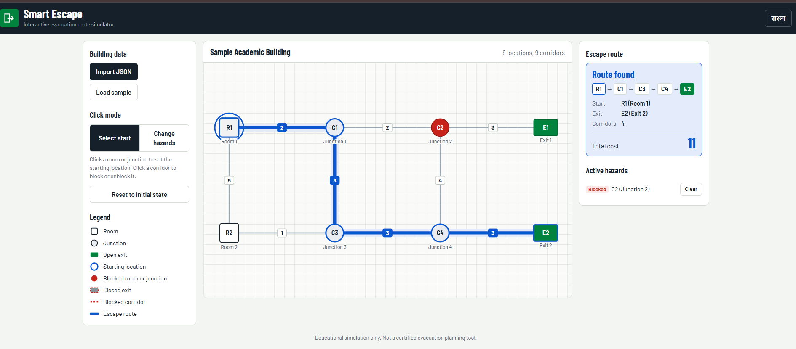

Smart Escape — Interactive Evacuation Route Simulator

Name:Kamruzzaman Amit
Registration number:232-15-192
Live link: https://kamruzzaman-cse.github.io/devfest-232-15-192/

Frontend-only web app that imports a building graph (`building.json`), draws it on an interactive map, and finds the lowest-cost route from a chosen start to an open exit. Every hazard change recalculates the route instantly.

## How to run
- Open the live link in Chrome, or open `index.html` locally (no build step, no server).
- Click **Import JSON** to load a `building.json`, or **Load sample** to try the built-in sample.

## Main features
- Strict JSON validation (node/edge limits, unique IDs, self-loops, repeated pairs, positive integer costs, initial_state categories) with clear bilingual error lists
- Map drawn at the supplied coordinates; rooms, junctions and exits use distinct shapes; corridor costs shown on every edge
- Start selection, block/unblock rooms, junctions and corridors, close/reopen exits; each state has its own visual style
- Dijkstra routing on sum of edge costs; tie-break by smallest exit ID, then lexicographically smallest node-ID sequence
- Shows node sequence, exit and total cost; "No route available" and "Starting location blocked" states
- Reset restores the file's original `initial_state`
- Full Bangla / English mode (language remembered in localStorage)
- Brief animations: node pop on click, route draw-in, status fade

## Bonus features
- Active hazards list with one-click clear
- Keyboard accessible map (Tab + Enter/Space on nodes and corridor costs)
- Responsive layout down to mobile; respects reduced-motion setting

## Known issues
- Very dense maps can have overlapping labels because the supplied coordinates are used as-is.

## AI tools used
- Claude (claude.ai)

## Most useful prompt
> (paste your best prompt here)

## Screenshots
- `baseline.png` — R1 → C1 → C2 → E1, cost 7
- `c2-blocked.png` — R1 → C1 → C3 → C4 → E2, cost 11

## License
MIT — see `LICENSE`.
